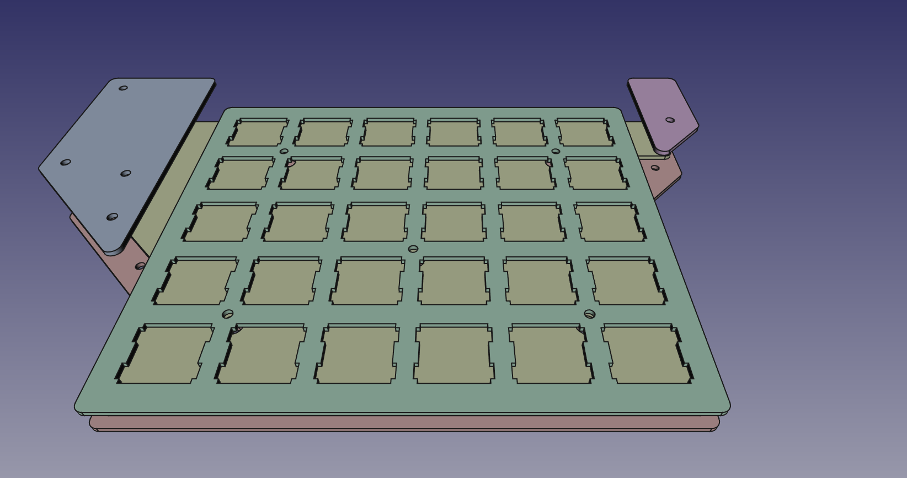

# five-by-six
`five-by-six` is a split keyboard design which tries to meet this goals:
- 5x6 keys per half (so [let's split](https://github.com/climbalima/let-s-Split-v2) with a number row)
- dual side pcb
- case design done in parametrical manner, in a CAD software
- high automations/scripting for predictable and reproducible results

## Table of content
- [five-by-six](#five-by-six)
  - [Table of content](#table-of-content)
- [Description](#description)
  - [PCB](#pcb)
  - [Case](#case)
  - [Automations](#automations)
  - [Development setup](#development-setup)
  - [Workflow](#workflow)

# Description
## PCB
PCB is designed in KiCAD with help of 3rd party libraries from [keebio](https://github.com/keebio) (components and footprints). Can't thank enough for battle tested, dual sided switch footprints. Keys are set in matrix of pitch 19.05mm. Arduino Pro Micro is placed on outside edge, jack is placed on the inside.


## Case
Case is designed in FreeCAD to achieve pure mechanical, parametrical description. Exported DXF (Autodesk DXF 2D(\*.dxf)) of every element is later manually imported in a clean KiCad's PCB as edge cuts. After that, every circle is replaced with a proper mounting hole.

Master sketch approach was used, learned with mr Ha Gei's [video](https://www.youtube.com/watch?v=8Bmcgn2RBGI).



## Automations
All the actions are hold in `tasks.py` files which are handled by [invoke](http://www.pyinvoke.org/). Case and PCB designs has it's own `tasks.py` which are design specific. Global one is used mainly for creating fabrication files.

Plotting scripts are built on [plotter](https://github.com/akshmakov/pcbops_template/blob/master/kicad_cicd/plotter.py) from [Andrey Shmakov](https://github.com/akshmakov). He also gave a nice talk during KiCon 2019 ([video](https://www.youtube.com/watch?v=cQ-iFtBBwFc)).

`circles_to_holes.py` was created to easily transfer FreeCAD design hole data to drill information.

## Development setup
This software versions was used:
 - KiCad 5.1.2
 - FreeCAD 0.18
 - Python 3.7 (though >= 3.6 should be fine)

Clone the repository, download submodules:
```
git submodule update --init --recursive
```

Under Linux environment KiCad libraries are setup for system wide python. The easiest way to install dependencies is to:
```
pip install -r requirements.txt --user
```

## Workflow
Short description of step by step procedure of development:
 - case:
   - design case and pcb contour in FreeCAD
   - export designs to DXFs
   - load case DXFs into empty KiCad projects, save, close
   - while being under `five-by-six/case` directory, run `inv circle-to-holes`, which would exchange every circle to proper M2 padded mounting holes
 - pcb:
   - design schematic, open pcb
   - load pcb contour DXF from case design
   - route PCB
   - run `inv circle-to-holes` which would exchange `Edge.Cuts` circles to 5mm drill holes (for standoffs)
 - making fabrication files
   - in root directory run `inv plot-all`; all gerbers should be plotted, zipped + some basic documentation and preview pdfs created as well
